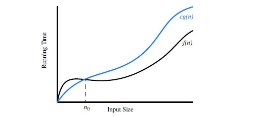
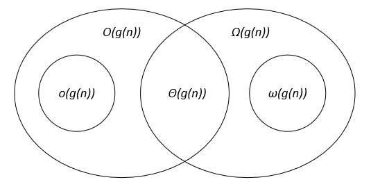
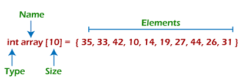
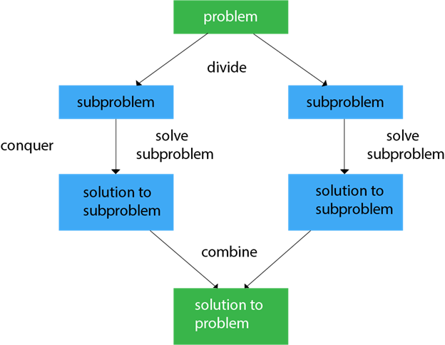
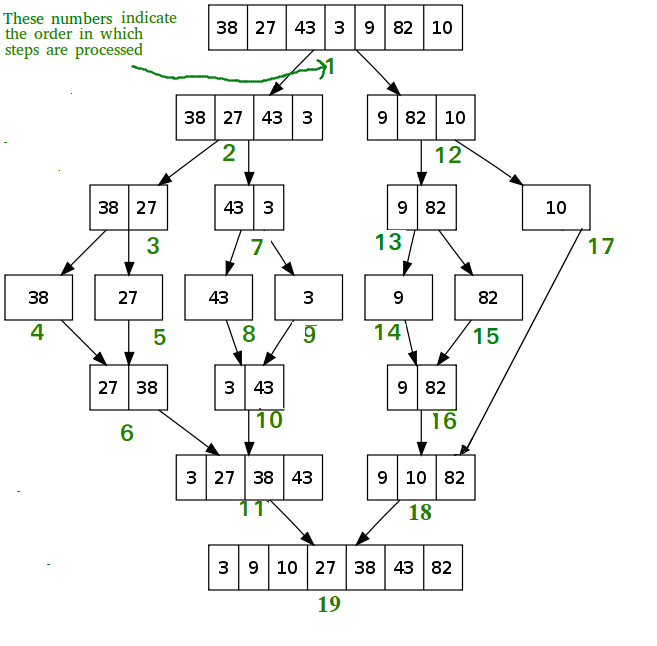
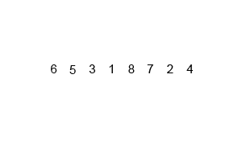

<div align="center">
  <a href="https://www.linkedin.com/in/aminkhani-ai/" targert="_blacnk">
    
  <a href="mailto:aminkhani2010@gmail.com" targert="_blacnk">
    
  </a>
  <a href="https://t.me/aminkhani_ai" targert="_blacnk">
    
  </a>  
  <a href="https://www.instagram.com/aminkhani_ai/" targert="_blacnk">
    
  </a>
  <a href="https://github.com/aminkhani/" targert="_blacnk">
    
  </a>
</div>
<br />
<div align="center">
  <h1 align="center">Data Structure & Algorithm (DSA) Tutorial</h1>
  <p align="center"> 
    <br />
   <a href="https://github.com/aminkhani/DSA/issues/new?assignees=&labels=bug&template=bug_report.yml&title=%5BBUG%5D%3A+">🐛Report Bug</a>
   .
   <a href="https://github.com/aminkhani/DSA/issues/new?assignees=&labels=question&template=question.yml&title=%5BQUESTION%5D%3A+">❓Ask Question</a>
   .
  <a href="https://github.com/aminkhani/DSA/issues/new?assignees=&labels=like&template=like.yml&title=%5BLIKE%5D%3A+">👍Like the repo</a>
  .
  <a href="https://github.com/aminkhani/DSA/issues/new?assignees=&labels=unlike&template=unlike.yml&title=%5BUNLIKE%5D%3A+">👎Dislike the repo</a>
  </p>
  </p>
</div><br />

</div>

> **Note**
>
> 📣 You can help to improve this repo, by giving me a **⭐star⭐** and **❤️following me❤️**

<h1 id="top">Contents</h1>
<ul>
    <li><a href="#data">Data Definition</a>
    </li>
    <li><a href="#ds_start">Data Structure Definition</a>
    <li><a href="#type_ds">Types of DS</a>
      <ol>
        <li><a href="#primitive">Primitive DS</a></li>
        <li><a href="#nonprimitive">Non-primitive DS</a></li>
      </ol>
    </li>
    <li><a href="#need_ds">Need of DS</a></li>
    <li><a href="#advantage_ds">Advantages of a DS</a></li>
    <li><a href="#DS_operation">DS Operations</a></li>
    <li><a href="#Usage_of_DS">Usage of DS</a></li>
    <li><a href="#Asymptotic_Notations">Asymptotic Notations</a>
      <ul>
        <li><a href="#big_o">Big O</a></li>
        <li><a href="#omega">Omega</a></li>
        <li><a href="#theta">Theta</a></li>
      </ul></li>
    <li><a href="#CommonAsymptoticNotations">Common Asymptotic Notations</a></li>
    </li>
    <li><a href="#popular_ds">Popular types of Data Structures</a>
        <ul>
            <li><a href="#array">Array</a></li>
            <li><a href="#">Linked List</a></li>
            <li><a href="#">Stack</a></li>
            <li><a href="#">Queue</a></li>
            <li><a href="#">Binary Tree</a></li>
            <li><a href="#">Binary Search Tree</a></li>
            <li><a href="#">Heap</a></li>
            <li><a href="#">Hashing</a></li>
            <li><a href="#">Graph</a></li>
            <li><a href="#">Matrix</a></li>
            <li><a href="#">Misc</a></li>
            <li><a href="#">Advanced Data Structure</a></li>
        </ul>
    </li>
    <li><a href="#start_ds">Algorithm Definition</a>
    <li><a href="#char_algorithm">Characteristics of an Algorithm</a></li>
    <li><a href="#dataflow">Dataflow of an Algorithm</a></li>
    <li><a href="#need_algo">Need of Algorithms</a></li>
    <li><a href="#algo_factors">Factors of an Algorithm</a></li>
    <li><a href="#importance_algo">Importance of Algorithms</a></li>
    <li><a href="#issues_algo">Issues of Algorithms</a></li>
    <li><a href="#appro_algo">Approaches of Algorithm</a>
      <ul>
        <li><a href="#brute_force">Brute Force</a></li>
        <li><a href="#divide">Divide & Conquer</a></li>
        <li><a href="#greedy">Greedy</a></li>
        <li><a href="#dynamic">Dynamic Programming</a></li>
        <li><a href="#branch">Branch & Bound</a></li>
        <li><a href="#random">Randomized</a></li>
        <li><a href="#back">Backtracking</a></li>
      </ul>
    </li>
    <li><a href="#cat_algo">Categories of Algorithms</a></li>
    <li><a href="#algo_analysis">Algorithm Analysis</a></li>
    <li><a href="#algo_comlexity">Algorithm Complexity</a></li>
    <li><a href="#type_algo">Types of Algorithms</a>
        <ul>
            <li><a href="#Search_Algo">Search Algorithm</a>
                <ul>
                    <li><a href="#linear_search">Linear Search</a></li>
                    <li><a href="#binary_search">Binary Search</a></li>
                </ul>
            </li>
            <li><a href="#Sort_Algo">Sort Algorithm</a>
                <ul>
                    <li><a href="#bubble">Bubble Sort</a></li>
                    <li><a href="#merge">Merge Sort</a></li>
                    <li><a href="#quick">Quick Sort</a></li>
                </ul>
            </li>
        </ul>
    </li>
    </li>
</ul>

<h1 id="data">What is Data?</h1>

- **Data** is the **collection** of different **numbers**, **symbols**, and **alphabets** to **represent information**.

<h1 id="ds_start">What is Data Structure?</h1>

- **Data Structure** is a **storage** that is used to **store** and **organize data**. It is a way of **arranging data** on a computer so that it can be **accessed** and **updated efficiently**.
<br>

- **Data Structure** is not only used for organizing the data. It is also used for **processing**, **retrieving**, and **storing data**. There are different basic and advanced types of data structures that are used in almost every program or software system that has been developed. So we must have good knowledge about data structures.
<br>

- The choice of a **good data structure** makes it possible to perform a variety of critical operations effectively. An **efficient data structure** also uses **minimum memory space and execution time** to process the structure.
<br>

- The **data structure** is **not any programming language** like **C**, **C++**, **java**, etc. It is a **set of algorithms** that we can use in any programming language to structure the data in the memory.
<br>

- **Data structure** has also defined an instance of **ADT**.**ADT** means **ABSTRACT DATA TYPE**.
  - An **ADT** tells **what** is to be done and **data structure** tells **how** it is to be done. In other words, we can say that **ADT** gives us the **blueprint** while **data structure** provides the **implementation** part.
<br>

- As the different data structures can be implemented in a particular ADT, but the different implementations are compared for **time and space**.
  - For example, the **Stack ADT** can be implemented by both **Arrays** and **linked list**. Suppose the **array** is **providing time efficiency** while the **linked list** is **providing space efficiency**, so the one which is the best suited for the current user's requirements will be selected.


<div align="right"><a href="#top" targert="_blacnk"></a></div>
<h1 id="type_ds">Types of Data Structures</h1>
<span id="primitive"></span>

### 1. Primitive Data Structure
  - The **primitive data structures** are **primitive data types**. The **int**, **char**, **float**, **double**, and **pointer** are the primitive data structures that can **hold a single value**.

<span id="nonprimitive"></span>

### 2. Non-primitive Data Structure
  - Linear Data Structure
  - Non-linear Data Structure


### Classification of Non-Primitive Data Structure: 

- ### Linear Data Structure
  - Data structure in which data elements are **arranged sequentially** or **linearly**, where each element is attached to its previous and next adjacent elements, is called a **linear data structure**.
  <br />

  - Examples of **linear data structures** are **[Array]()**, **[Stack]()**, **[Queue]()**, **[Linked List]()**, etc.
    <br />

  - #### Static Data Structure
    - **Static data structure** has a **fixed memory size**. It is **easier to access the elements** in a **static data structure**. 
    - An example of this **data structure** is an **Array**.
    <br>

  - #### Dynamic Data Structure
    - In **dynamic data structure**, the size is **not fixed**. It can be randomly updated during the runtime which may be considered efficient concerning the memory (space) complexity of the code. 
    - Examples of this **data structure** are **Queue**, **Stack**, **Linked List** etc.


- ### Non-linear Data Structure
  - **Data structures** where data elements are **not placed sequentially** or **linearly** are called **non-linear data structures**. In a **non-linear data structure**, we can’t traverse all the elements in a single run only. 
  <br>

  - Examples of **non-linear data structures** are **[Trees]()** and **[Graphs]()**.

<div align="right"><a href="#top" targert="_blacnk"></a></div>

<h1 id="need_ds">Need of Data Structures</h1>

As applications are getting **complexed** and **amount of data is increasing day by day**, there may arrise the following problems:

- ### Processor Speed
  - To handle very large amout of data, high speed processing is required, but as the data is growing day by day to the billions of files per entity, processor may fail to deal with that much amount of data.

- ### Data Search 
  - Consider an inventory size of 106 items in a store, If our application needs to search for a particular item, it needs to traverse 106 items every time, results in slowing down the search process.

- ### Multiple Requests
  -  If thousands of users are searching the data simultaneously on a web server, then there are the chances that a very large server can be failed during that process

in order to **solve the above problems**, **data structures are used**. Data is organized to form a data structure in such a way that all items are not required to be searched and required data can be searched instantly.

<div align="right"><a href="#top" targert="_blacnk"></a></div>

<h1 id="advantage_ds">Advantages of a Data Structure</h1>

- ### Efficiency
  -  If the choice of a data structure for implementing a particular ADT is proper, it makes the program very efficient in terms of time and space.
- ### Reusability
  -  The data structure provides reusability means that multiple client programs can use the data structure.
- ### Abstraction
  -  The data structure specified by an ADT also provides the level of abstraction. The client cannot see the internal working of the data structure, so it does not have to worry about the implementation part. The client can only see the interface.

<div align="right"><a href="#top" targert="_blacnk"></a></div>

<h1 id ="DS_operation">Common operations on Data Structures</h1>

- ### Searching 
  - We can search for any element in a data structure.
- ### Sorting 
  - We can sort the elements of a data structure either in an ascending or descending order.
- ### Insertion
  -  We can also insert the new element in a data structure.
- ### Updation
  -  We can also update the element, i.e., we can replace the element with another element.
- ### Deletion 
  - We can also perform the delete operation to remove the element from the data structure.

<div align="right"><a href="#top" targert="_blacnk"></a></div>

<h2 id="Usage_of_DS">Data Structures are used in various fields such as:</h2>

- ### Operating system
- ### Graphics
- ### Computer Design
- ### Blockchain
- ### Genetics
- ### Image Processing
- ### Simulation etc.

<div align="right"><a href="#top" targert="_blacnk"></a></div>

<h1 id="Asymptotic_Notations">Asymptotic Notations</h1>

Usually, the time required by an algorithm comes under three types:
#### 1. Worst Case
  - It defines the input for which the algorithm takes a huge time.

#### 2. Average Case
  - It takes average time for the program execution.

#### 3. Best Case
  - It defines the input for which the algorithm takes the lowest time

The commonly used **asymptotic notations** used for calculating the **running time complexity** of an algorithm is given below:

<span id="big_o"></span>

## Big O Notation (O)
- **Big O** notation is an asymptotic notation that measures the performance of an algorithm by simply providing the order of growth of the function.
<br>

- This notation provides an **upper bound** on a function which ensures that the **function never grows faster than the upper bound**.
  
It is the formal way to **express the upper boundary** of an algorithm running time. It measures the **worst case of time complexity** or the algorithm's **longest amount of time** to complete its operation. It is represented as shown below:
<br>

<div align="right"><a href="#top" targert="_blacnk"></a></div>
<h2 id="small_o">Little o</h2>


<span id="omega"></span>

## Omega Notation (Ω)
- It basically describes the **best-case scenario** which is opposite to the **big o notation**.
<br>

- It is the formal way to represent the **lower bound** of an algorithm's running time. It measures the **best amount of time** an algorithm can possibly take to complete or the best-case time complexity.
<br>

- It determines what is the **fastest time** that an algorithm can run.

<span id="theta"></span>

## Theta Notation (θ)
- The theta notation mainly describes the **average case scenarios**.
<br>

- It represents the **realistic time complexity** of an algorithm. Every time, an algorithm does not perform **worst or best**, in real-world problems, algorithms mainly **fluctuate** between the **worst-case and best-case**, and this gives us the average case of the algorithm.
<br>

- **Big theta** is mainly used when the value of worst-case and the best-case is same.
<br>

- It is the formal way to express **both** the **upper bound** and **lower bound** of an algorithm running time.

<h2 id="CommonAsymptoticNotations">Common Asymptotic Notations</h2>

- #### constant : Ο(1)
- #### logarithmic	: Ο(log n)
- #### linear : Ο(n)
- #### n log n : Ο(n log n)
- #### quadratic : Ο(n<sup>2</sup>)
- #### cubic : Ο(n<sup>3</sup>)
- #### polynomial : n<sup>Ο(1)<sup>
- #### exponential	: 2<sup>Ο(n)<sup>


<div align="right"><a href="#top" targert="_blacnk"></a></div>

<h1 id="popular_ds">Popular Types of Data Structures</h1>

<h1 id="array">Array</h1>

- Arrays are defined as the collection of similar or different  types of data items stored at contiguous memory locations.
<br>

- It is one of the simplest data structures where each data element can be randomly accessed by using its index number.

<h3>Properties of Array</h3>

- Each element in an array is of the same data type and carries the same size that is 4 bytes.
<br>

- Elements in the array are stored at contiguous memory locations from which the first element is stored at the smallest memory location.
<br>

- Elements of the array can be randomly accessed since we can calculate the address of each element of the array with the given base address and the size of the data element.
<br>
        
<h3>Representation of an Array</h3>   
<br>

- Index starts with 0.
- The array's length is 10, which means we can store 10 elements.
- Each element in the array can be accessed via its index.
    
<h3>Why are Arrays Required?</h3>
        
- Sorting and searching a value in an array is easier.
<br>
  
- Arrays are best to process multiple values quickly and easily.
<br>

- Arrays are good for storing multiple values in a single variable - In computer programming, most cases require storing a large number of data of a similar type. To store such an amount of data, we need to define a large number of variables. It would be very difficult to remember the names of all the variables while writing the programs. Instead of naming all the variables with a different name, it is better to define an array and store all the elements into it.
      
<h3>Memory Allocation of an Array</h3>
<h3>Advantages of Array</h3>
<h3>Disadvantages of Array</h3>


<div align="right"><a href="#top" targert="_blacnk"></a></div>

<h1 id="start_ds">What is an Algorithm?</h1>

- **Algorithm** is a **process** or a **set of rules** required to perform calculations or some other problem-solving operations especially by a **computer**. 
<br>

- The **formal definition of an algorithm** is that it contains the **finite set of instructions** which are being carried in a **specific order** to perform the specific task. It is **not the complete program** or **code**; it is **just a solution (logic) of a problem**, which can be represented either as an informal description using a **Flowchart** or **Pseudocode**.

<div align="right"><a href="#top" targert="_blacnk"></a></div>

<h2 id="char_algorithm">Characteristics of an Algorithm</h2>

- ### Input
  - An algorithm has some input values. We can pass 0 or some input value to an algorithm.
- ### Output
  - We will get 1 or more output at the end of an algorithm.
- ### Unambiguity
  - An algorithm should be unambiguous which means that the instructions in an algorithm should be **clear and simple**.
- ### Finiteness
  - An algorithm should have finiteness. Here, finiteness means that the algorithm should contain a limited number of instructions, i.e., the instructions should be **countable**.
- ### Effectiveness
  - An algorithm should be effective as each instruction in an algorithm affects the overall process.
- ### Language independent
  - An algorithm must be language-independent so that the instructions in an algorithm can be implemented in **any of the languages** with the same output.

<div align="right"><a href="#top" targert="_blacnk"></a></div>

<h1 id="dataflow">Dataflow of an Algorithm</h1>

- ### Problem
  - A problem can be a real-world problem or any instance from the real-world problem for which we need to create a program or the set of instructions. The set of instructions is known as an algorithm.
- ### Algorithm
  - An algorithm will be designed for a problem which is a step by step procedure.
- ### Input
  - After designing an algorithm, the required and the desired inputs are provided to the algorithm.
- ### Processing Unit
  - The input will be given to the processing unit, and the processing unit will produce the desired output.
- ### Output
  - The output is the outcome or the result of the program.

<div align="right"><a href="#top" targert="_blacnk"></a></div>

<h2 id="need_algo">We need Algorithms because of the following reasons:</h2>

- ### Scalability
  - It helps us to understand the scalability. When we have a big real-world problem, we need to scale it down into **small-small steps** to **easily analyze** the problem.
- ### Performance
  - The real-world is not easily broken down into smaller steps. If the problem can be easily broken into smaller steps means that the problem is feasible.

<div align="right"><a href="#top" targert="_blacnk"></a></div>

<h2 id="algo_factors">Factors for Designing an Algorithm</h2>

- ### Modularity
  -  If any problem is given and we can break that problem into **small-small modules** or **small-small steps**, which is a basic definition of an algorithm, it means that this feature has been perfectly designed for the algorithm.
- ### Correctness 
  - The correctness of an algorithm is defined as when the **given inputs produce the desired output**, which means that the algorithm has been designed algorithm. The analysis of an algorithm has been done correctly.
- ### Maintainability
  - Here, maintainability means that the algorithm should be designed in a **very simple structured** way so that when we **redefine** the algorithm, **no major change will be done** in the algorithm.
- ### Functionality
  - It considers **various logical steps** to solve the real-world problem.
- ### Robustness
  - Robustness means that how an algorithm can **clearly define our problem**.
- ### User-friendly
  - If the algorithm is not user-friendly, then the designer will not be able to explain it to the programmer.
- ### Simplicity 
  - If the algorithm is **simple** then it is **easy to understand**.
- ### Extensibility
  - If any other algorithm designer or programmer wants to use your algorithm then it should be extensible.

<div align="right"><a href="#top" targert="_blacnk"></a></div>

<h2 id="importance_algo">Importance of Algorithms</h2>

- ### Theoretical Importance
  - When any real-world problem is given to us and we break the problem into small-small modules. To break down the problem, we should know all the theoretical aspects.
- ### Practical Importance
  - As we know that **theory cannot be completed without the practical implementation**. So, the importance of **algorithm** can be **considered as both theoretical and practical**.

<div align="right"><a href="#top" targert="_blacnk"></a></div>

<h2 id="issues_algo">Issues for Designing an Algorithm:</h2>

- ### How to design algorithms
  -  As we know that an algorithm is a step-by-step procedure so we must follow some steps to design an algorithm.
- ### How to analyze algorithm efficiency

<div align="right"><a href="#top" targert="_blacnk"></a></div>

<h1 id="appro_algo">Approaches for Designing an Algorithm</h1>

<span id="brute_force"></span>

## Brute force algorithm 
- The **general logic structure** is applied to **design an algorithm**. It is also known as an **exhaustive search algorithm** that searches all the **possibilities** to provide the required solution. Such algorithms are of two types:
- **Optimizing**
  - Finding **all the solutions of a problem** and then take out the **best solution** or if the value of the best solution is known then it will terminate if the best solution is known.
- **Sacrificing**
  -  As soon as the best solution is found, then it will **stop**.
<br>
<div align="right"><a href="#top" targert="_blacnk"></a></div>
<span id="divide"></span>

## Divide & Conquer
- **Divide and Conquer** is an **algorithmic pattern**. In **algorithmic methods**, **break the input into minor pieces**, decide the problem on each of the **small pieces**, and then **merge** the **piecewise solutions** into a **global solution**.
<br>

- ### Steps for Divide & Conquer
  - **Divide** the problem into **smaller sub-problems**.
  - **Conquer of Solve** the sub-problems **recursively**.
  - **Combine** the **solutions** of the sub-problems to **solve** the original problem.
<br>

<br>

- **Examples:** The **specific computer algorithms** are based on the **Divide & Conquer approach**:
  1. **[Maximum and Minimum Problem]()**
  2. **[Binary Search]()**
  3. **[Sorting (merge sort, quick sort)]()**
  4. **[Tower of Hanoi]()**

#### Fundamental of Divide & Conquer Strategy:
- There are two fundamental of **Divide & Conquer Strategy**:
  1. **Relational Formula**
     - It is the formula that we generate from the given technique. After generation of Formula we apply D&C Strategy, i.e. we break the problem recursively & solve the broken subproblems.
   <br>

  2. **Stopping Condition**
     - When we break the problem using Divide & Conquer Strategy, then we need to know that for how much time, we need to apply divide & Conquer. So the condition where the need to stop our recursion steps of D&C is called as **Stopping Condition**. 

#### Applications of Divide and Conquer Approach:
Following algorithms are based on the concept of the Divide and Conquer Technique:

- **[Binary Search](#binary_search)**
- **[Quicksort]()**: It is the most efficient sorting algorithm, which is also known as partition-exchange sort. It starts by selecting a pivot value from an array followed by dividing the rest of the array elements into two sub-arrays. The partition is made by comparing each of the elements with the pivot value. It compares whether the element holds a greater value or lesser value than the pivot and then sort the arrays recursively.
<br>

- **[Merge Sort](#merge)**
<br>

- **[Closest Pair of Points]()**: It is a problem of computational geometry. This algorithm emphasizes finding out the closest pair of points in a metric space, given n points, such that the distance between the pair of points should be minimal.
<br>

- **[Strassen's Algorithm]()**: It is an algorithm for matrix multiplication, which is named after Volker Strassen. It has proven to be much faster than the traditional algorithm when works on large matrices.
<br>

- **[Cooley-Tukey Fast Fourier Transform (FFT) algorithm]()**: The Fast Fourier Transform algorithm is named after J. W. Cooley and John Turkey. It follows the Divide and Conquer Approach and imposes a complexity of O(nlogn).
<br>

- **[Karatsuba algorithm for fast multiplication]()**: It is one of the fastest multiplication algorithms of the traditional time, invented by Anatoly Karatsuba in late 1960 and got published in 1962. It multiplies two n-digit numbers in such a way by reducing it to at most single-digit.

#### Advantages of Divide and Conquer
- **Divide and Conquer** tend to successfully solve one of the biggest problems, such as the **Tower of Hanoi**, a **mathematical puzzle**. It is challenging to solve complicated problems for which you have no basic idea, but with the help of the divide and conquer approach, it has lessened the effort as it works on dividing the main problem into two halves and then solve them **recursively**. This algorithm is much **faster than other algorithms**.
<br>

- It efficiently uses **cache memory** without **occupying much space** because it solves simple subproblems within the cache memory instead of accessing the slower main memory.
<br>

- It is more proficient than that of its counterpart Brute Force technique.
<br>

- Since these algorithms inhibit parallelism, it does not involve any modification and is handled by systems incorporating parallel processing.

#### Disadvantages of Divide and Conquer
- Since most of its algorithms are designed by incorporating recursion, so it necessitates high memory management.
<br>

- An explicit stack may overuse the space.
<br>

- It may even crash the system if the recursion is performed rigorously greater than the stack present in the CPU.
<div align="right"><a href="#top" targert="_blacnk"></a></div>
<span id="greedy"></span>

## Greedy Algorithm
- It is an **algorithm paradigm** that makes an optimal choice on each iteration with the hope of getting the best solution. It is **easy to implement** and has a **faster execution time**. But, there are very rare cases in which it provides the optimal solution.
<br>
<div align="right"><a href="#top" targert="_blacnk"></a></div>
<span id="dynamic"></span>

## Dynamic programming
- It makes the algorithm more **efficient** by **storing the intermediate results**. It follows **five different steps** to **find the optimal solution** for the problem:
   1. It breaks down the **problem** into a **subproblem** to find the **optimal solution**.
   2. After breaking down the problem, it finds the optimal solution out of these subproblems.
   3. **Stores the result** of the subproblems is known as **memorization**.
   4. Reuse the result so that it cannot be recomputed for the same subproblems.
   5. Finally, it computes the result of the complex program.
<br>
<div align="right"><a href="#top" targert="_blacnk"></a></div>
<span id="branch"></span>

## Branch & Bound Algorithm
- The **branch and bound algorithm** can be applied to **only integer programming problems**. This approach divides all the sets of feasible solutions into smaller subsets. These subsets are further evaluated to find the best solution.
<br>
<div align="right"><a href="#top" targert="_blacnk"></a></div>
<span id="random"></span>

## Randomized Algorithm
- As we have seen in a **regular algorithm**, we have **predefined input and required output**. Those algorithms that have some defined set of inputs and required output, and follow some described steps are known as **deterministic algorithms**. 
<br>

- What happens that when the **random variable** is introduced in the **randomized algorithm**?
  - **In a randomized algorithm**, some **random bits** are introduced by the algorithm and added in the input to produce the output, which is random in nature. Randomized algorithms are **simpler and efficient** than the **deterministic algorithm**.
<br>
<div align="right"><a href="#top" targert="_blacnk"></a></div>
<span id="back"></span>

## Backtracking
- **Backtracking** is an **algorithmic technique** that solves the problem **recursively** and **removes the solution** if it does not satisfy the constraints of a problem.

<div align="right"><a href="#top" targert="_blacnk"></a></div>

<h1 id="cat_algo">Major categories of Algorithms</h1>

- ### Sort 
  - Algorithm developed for sorting the items in a certain order.
- ### Search
  - Algorithm developed for searching the items inside a data structure.
- ### Delete
  - Algorithm developed for deleting the existing element from the data structure.
- ### Insert
  - Algorithm developed for inserting an item inside a data structure.
- ### Update
  - Algorithm developed for updating the existing element inside a data structure.

<div align="right"><a href="#top" targert="_blacnk"></a></div>

<h1 id="algo_analysis">Algorithm Analysis</h1>

The **algorithm** can be **analyzed** in two levels, i.e., first is **before creating the algorithm**, and second is **after creating the algorithm**. The following are the two **analysis of an algorithm**:

- ### Priori Analysis 
  - Here, **priori analysis** is the **theoretical analysis** of an algorithm which is done **before implementing the algorithm**. Various factors can be considered before implementing the algorithm like **processor speed**, which has no effect on the implementation part.
<br>

- ### Posterior Analysis
  - Here, **posterior analysis** is a **practical analysis** of an algorithm. The **practical analysis** is achieved by implementing the algorithm using any **programming language**. This analysis basically evaluate that **how much running time and space** taken by the algorithm.

<div align="right"><a href="#top" targert="_blacnk"></a></div>

<h1 id="algo_comlexity">Algorithm Complexity</h1>

The **performance** of the **algorithm** can be measured in **two factors**:

## 1. Time Complexity
  - The **time complexity of an algorithm** is the **amount of time** required to **complete the execution**. 
  <br>

  - The time **complexity of an algorithm** is denoted by the **big O notation**. 
    - Here, **big O notation** is the asymptotic notation to represent the **time complexity**.
  <br>

  - The **time complexity** is mainly calculated by **counting the number of steps** to finish the execution.
<br>

## 2. Space Complexity
  - An **algorithm's space complexity** is the **amount of space required** to solve a problem and produce an output. Similar to the **time complexity**, **space complexity** is also expressed in **big O** notation.

### Auxiliary Space
  - The **extra space** required by the algorithm, excluding the input size, is known as an auxiliary space. The space complexity considers both the spaces, i.e., auxiliary space, and space used by the input.
<br>

#### Space complexity = Auxiliary space + Input size

<div align="right"><a href="#top" targert="_blacnk"></a></div>

<h1 id="type_algo">Types of Algorithm</h1>
<span id="Search_Algo"></span>

# Search Algorithm
On each day, we search for something in our day to day life. Similarly, with the case of computer, huge data is stored in a computer that whenever the user asks for any data then the computer searches for that data in the memory and provides that data to the user. There are mainly two techniques available to search the data in an array:
<span id="linear_search"></span>

### 1. Linear Search
- Linear search is a very simple algorithm that starts searching for an element or a value from the beginning of an array until the required element is not found. It compares the element to be searched with all the elements in an array, if the match is found, then it returns the index of the element else it returns -1. This algorithm can be implemented on the unsorted list.
<br> 

<br>    

```C++
// Array Name: arr
// Array Size: N
// Element to be searched: x
int search(int arr[], int N, int x)
{
  int i;
  for (i = 0; i < N; i++)
      if (arr[i] == x)
          return i;
  return -1;
}
```
<br>

- **Time Complexity:** **$O(n)$**
<br>

```C++
// Linear Search Recursive Approach
int search(int arr[], int N, int x)
{
  if (N == 0) {
      return -1;
  }
  else if (arr[N - 1] == x) {
      // Return the index of found x.
      return N - 1;
  }
  else {
      int ans = search(arr, N - 1, x);
      return ans;
  }
}
``` 
<br>

- **Time Complexity:** **$O(n)$**
      
<div align="right"><a href="#top" targert="_blacnk"></a></div>    
<span id="binary_search"></span>

### 2. Binary Search
The binary search algorithm is a searching algorithm, which is also called a half-interval search or logarithmic search. It works by comparing the target value with the middle element existing in a sorted array. After making the comparison, if the value differs, then the half that cannot contain the target will eventually eliminate, followed by continuing the search on the other half. We will again consider the middle element and compare it with the target value. The process keeps on repeating until the target value is met. If we found the other half to be empty after ending the search, then it can be concluded that the target is not present in the array.
<br>

<br>

```C++  
// Iteration Method
// Array arr[low...high] is sorted
int binarySearch(int arr[], int low, int high, int x)
{
    while (low <= high) {
        int mid = (high - low) / 2;
        // Check if x is present at mid
        if (arr[mid] == x)
            return mid;
        // If x greater, ignore left half
        if (arr[mid] < x)
            low = mid + 1;
        // If x is smaller, ignore right half
        else
            high = mid - 1;
    }
    // if we reach here, then element was
    // not present
    return -1;
}
``` 
<br>

- **Time Complexity**: **$O(log n)$**
<br> 

```C++
// Recursive Method
// Array arr[low...high] is sorted
int binarySearch(int arr[], int low, int high, int x)
{
    if (high >= low) {
        int mid = (high - low) / 2;
        // If the element is present at the middle itself
        if (arr[mid] == x)
            return mid;
        // If element is smaller than mid, then it can only be present in left subarray
        if (arr[mid] > x)
            return binarySearch(arr, low, mid - 1, x);
        // Else the element can only be present in right subarray
        return binarySearch(arr, mid + 1, high, x);
    }
    // We reach here when element is not present in array
    return -1;
}
```
<br>

- **Time Complexity**: **$O(log n)$**
<br> 
<div align="right"><a href="#top" targert="_blacnk"></a></div>
<span id="Sort_Algo"></span>

# Sort Algorithm
Sorting algorithms are used to rearrange the elements in an array or a given data structure either in an ascending or descending order. The comparison operator decides the new order of the elements.
<br>

**Why do we need a sorting algorithm?**
- An efficient sorting algorithm is required for optimizing the efficiency of other algorithms like binary search algorithm as a binary search algorithm requires an array to be sorted in a particular order, mainly in ascending order.
<br>

- It produces information in a sorted order, which is a human-readable format.
<br>

- Searching a particular element in a sorted list is faster than the unsorted list.
 
<div align="right"><a href="#top" targert="_blacnk"></a></div>
<span id="bubble"></span>

## Bubble Sort
- Bubble Sort is the simplest sorting algorithm that works by repeatedly swapping the adjacent elements if they are in the wrong order. This algorithm is not suitable for large data sets as its average and worst-case time complexity is quite high.
<br>

<br>

```C++
// Bubble Sort
void bubbleSort(int arr[], int n)
{
    int i, j;
    for (i = 0; i < n - 1; i++)
        // Last i elements are already in place
        for (j = 0; j < n - i - 1; j++)
            if (arr[j] > arr[j + 1])
                swap(&arr[j], &arr[j + 1]);
}
```
<br>

```C++
// Bubble Sort Recursive Approach
void bubbleSort(int arr[], int n)
{
    // Base case
    if (n == 1 || n == 0)
        return;
    // One pass of bubble sort. After
    // this pass, the largest element
    // is moved (or bubbled) to end.
    for (int i = 0; i < n - 1; i++)
        if (arr[i] > arr[i + 1])
            swap(&arr[i], &arr[i + 1]);
    // Largest element is fixed,
    // recur for remaining array
    bubbleSort(arr, n - 1);
}
```
- **Time Complexity**
  - Best Case: **$O(n)$**
  - Average Case: **$O(n^2)$**
  - Worst Case: **$O(n^2)$**

<div align="right"><a href="#top" targert="_blacnk"></a></div>
<span id="merge"></span>

## Merge Sort
- It is a sorting algorithm that sorts an array by making comparisons. It starts by dividing an array into sub-array and then recursively sorts each of them. After the sorting is done, it merges them back.
<br>

<br>


```C++
  // Merge Sort
void merge(int arr[], int beg, int mid, int end)
{
    int i, j, k;
    int n1 = mid - beg + 1;
    int n2 = end - mid;
    // create temp arrays
    int L[n1], R[n2];
    // Copy data to temp arrays L[] and R[]
    for (i = 0; i < n1; i++)
        L[i] = arr[beg + i];
    for (j = 0; j < n2; j++)
        R[j] = arr[mid + 1 + j];
    // Merge the temp arrays back into arr[l..r]
    i = 0; // Initial index of first subarray
    j = 0; // Initial index of second subarray
    k = l; // Initial index of merged subarray
    while (i < n1 && j < n2){
        if (L[i] <= R[j]) {
            arr[k] = L[i];
            i++;
        }
        else {
            arr[k] = R[j];
            j++;
        }
        k++;
    }
    // Copy the remaining elements of L[], if there are any
    while (i < n1){
        arr[k] = L[i];
        i++;
        k++;
    }
    // Copy the remaining elements of R[], if there are any
    while (j < n2){
        arr[k] = R[j];
        j++;
        k++;
    }
}
// beg is for left index and end is right index of the sub-array of arr to be sorted
void mergeSort(int arr[], int beg, int end)
{
  if (beg < end){  
    int mid = (beg + end) / 2;  
    mergeSort(a, beg, mid);  
    mergeSort(a, mid + 1, end);  
    merge(a, beg, mid, end);  
  }  
}
```


- **Time Complexity**
  - Best Case: **$O(nlogn)$**
  - Average Case: **$O(nlogn)$**
  - Worst Case: **$O(nlogn)$**

<div align="right"><a href="#top" targert="_blacnk"></a></div>
<span id="quick">

## Quick Sort
- It is an algorithm of Divide & Conquer type.

- **Divide**
  - Rearrange the elements and split arrays into two sub-arrays and an element in between search that each element in left sub array is less than or equal to the average element and each element in the right sub- array is larger than the middle element.

- **Conquer**
  - Recursively, sort two sub arrays.

- **Combine**
  - Combine the already sorted array.

```C++
void swap(int* a, int* b)
{
    int t = *a;
    *a = *b;
    *b = t;
}
  
/* This function takes last element as pivot, places
the pivot element at its correct position in sorted
array, and places all smaller (smaller than pivot)
to left of pivot and all greater elements to right
of pivot */
int partition(int arr[], int low, int high)
{
    int pivot = arr[high]; // pivot
    int i
        = (low
           - 1); // Index of smaller element and indicates
                 // the right position of pivot found so far
  
    for (int j = low; j <= high - 1; j++) {
        // If current element is smaller than the pivot
        if (arr[j] < pivot) {
            i++; // increment index of smaller element
            swap(&arr[i], &arr[j]);
        }
    }
    swap(&arr[i + 1], &arr[high]);
    return (i + 1);
}
  
/* The main function that implements QuickSort
arr[] --> Array to be sorted,
low --> Starting index,
high --> Ending index */
void quickSort(int arr[], int low, int high)
{
    if (low < high) {
        /* pi is partitioning index, arr[p] is now
        at right place */
        int pi = partition(arr, low, high);
  
        // Separately sort elements before
        // partition and after partition
        quickSort(arr, low, pi - 1);
        quickSort(arr, pi + 1, high);
    }
}
```
<div align="right"><a href="#top" targert="_blacnk"></a></div>